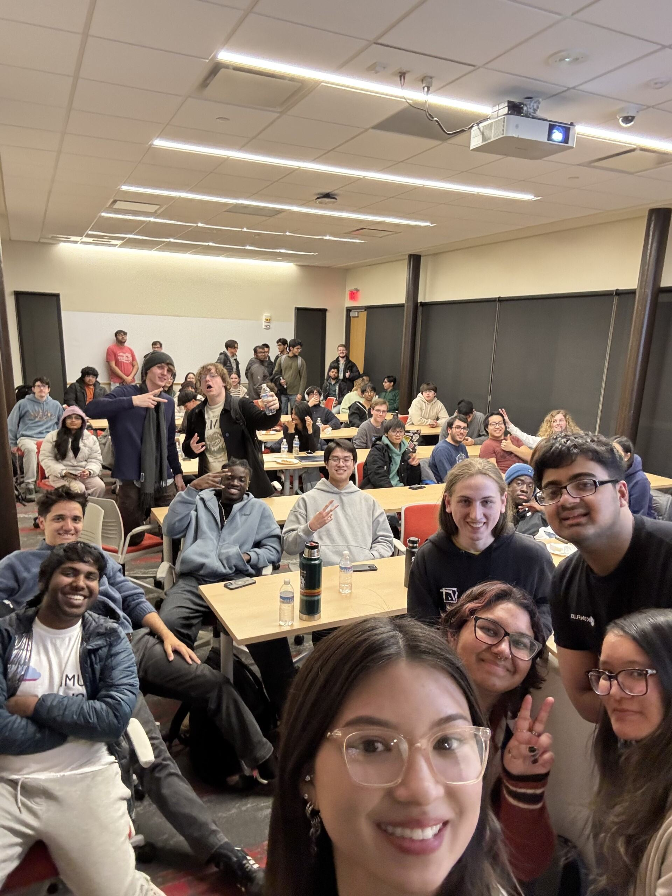

Hi folks! As the summer ends and the new semester begins, I wanted to share a couple of final words.

I want to thank everyone who supported us last year. From the eboard members who dedicated their time to crafting our meetings to the students who showed up, I'm glad that we were able to get this club off the ground and running again.

When I took over ACM at UMass Lowell from the previous eboard, it was in shambles. No meetings were held, and the club was de-registered by the university. I spent the following months finding new eboard members and going through the process of re-registering the club.

Our first semester had its ups and downs. Meetings ranged from full attendance to none at all. Some of our meeting topics confused our members, such as Natural Language Processing. But we pushed through and we created meetings that were fun and informative.

By our second semester, things really turned around We had speakers that students could relate to, from entrepreneurs to game developers in our CS community. We held our largest meeting of the year, a resume review session where students learned how to craft a resume for tech careers. My officers and I were thrilled to learn that some students were able to land interviews after participating in our resume review meeting.

Now that the year (and the summer) has come to an end, I am pleased to announce your new ACM eboard for the 2025-26 academic year:

- President: Charlie Norton​
- Vice President: Melissa Ing​
- Secretary: Matias Stringa​
- Treasurer: Roshan Rajesh​
- Graphic Designer: Christina Tran​
- Director of Partnerships: Aryaman Shah ​
- Director of Public Relations: Nicolas Busse

I wish Charlie and the new eboard nothing but the best as they take ACM to the next level.

Thank you for letting serve as your ACM president this year.  I'm glad I could make a difference, big or small, for all of you. I couldn't ask for anything more.

Signing off,
Rohan Mallu ❤️

<!-- truncate -->